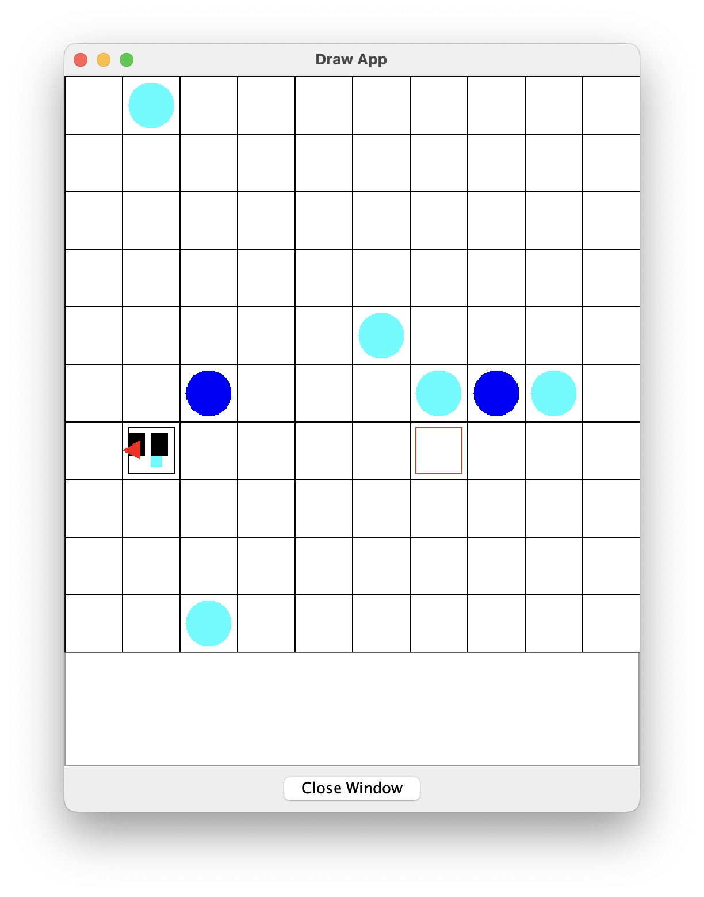

# C Coursework

Welcome to my coursework! In this version of the coursework with an added twist! What's displayed is a spirit (Robot) recollecting tears (Markers). All stages of the coursework have been completed!



The cyan (light blue) markers represent an obstacle and the darker blue markers are the tears/markers that the child collects. The child has a triangle representing it's current direction, this is only in the program for orientation for the user. The red square represents the robot's home.

## Dependancies

To install this project, you need a C compiler, in this file I explain everything with GCC.

## How to run
First, we need to compile the code to do this we need to make sure we have gcc installed. Once installed, run on your terminal on the same folder as the files the following command:

```c
gcc -o "INSERT_FILE_NAME_HERE" setup.c
```
Beautiful! Now we need to run the actual compiled code. To do this we need to input the following command onto our terminal. (Make sure you're still in the same directory)
```c
./"INSERT_FILE_NAME_HERE" | java -jar  drawapp-3.0.jar
```
This will initialise the random version of the game. If you want to manually enter variables here's a guide on how to utilise command line arguments to do so.
```c
./"INSERT_FILE_NAME_HERE" <InitialX> <InitialY> <InitialDirection> <rowSize> <columnSize> <numberoftargets> <numberofobstacles> | java -jar  drawapp-3.0.jar
```

This might seem a little intimidating but here's an example command.

```c
./test 2 4 north 10 10 4 9 | java -jar  drawapp-3.0.jar
```


### Optional:

If you want a simpler way to run the random version of the program, I have also provided a make file. (This will only work on GCC compilers.)

Just run the following on your terminal and it will do everything for you!
```c
make run
```
## Constraints

Please keep in mind the following constraints when running the commands.
```
initialX can be any number between 0 and rowSize - 1.
```
```
initialY can be any number between 0 and columnSize - 1.
```
(This is due to the fact that the way I number each block is from 0.)
```
initialDirection can only be north, south, east and west.
```

